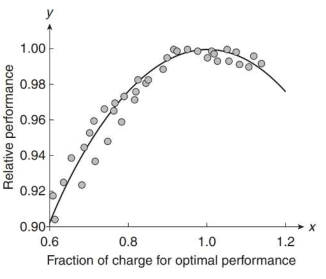

::: {#exr-}
## Dataset `B.csv`


```{r}
#| echo: false
dat <- read.csv('B.csv')
```

Consider the interaction model, $E(y)=\beta_0+\beta_1x_1+\beta_2x_4+\beta_3x_1x_4$, where 
<!-- 
- $y$: desire to have cosmetic surgery (25-point scale)
- $x_1$: {1 if male, 0 if female}
- $x_4$: impression of reality TV (7-point scale).  -->

Variables:

- $y$: scale ranging from 8 to 40
- $x_1$: scale ranging from 1 to 10
<!-- - $x_2$: scale ranging from 2 to 6
- $x_3$: scale ranging from 8 to 18 -->
- $x_4$: 1 or 0 
  


a. Give the least squares prediction equation.
b. Find the predicted $y$ for $x_4=1$ and $x_1=5$.
c. Conduct a test of overall model adequacy. Use $\alpha=0.10$.
d. Give a practical interpretation of $R^2_a$.
e. Give a practical interpretation of $s$.
f. Conduct a test (at $\alpha=0.10$) to determine if $x_1$ and $x_4$ interact in the prediction of $y$.

<!-- 
|Model|R|R Square|Adjusted R Square|Std. Error of the Estimate|
|:---:|:---:|:---:|:---:|:---:|
|1|.670|.449|.439|2.350|

: Model Summary 

|Model||Sum of Squares|df|Mean Square|F|Sig.|
|--|:---|:---:|:---:|:---:|:---:|:---:|
|1|Regression|747.001|3|249.000| 45.086|0.000|
||Residual|916.787|166|5.523| ||
||Total|1663.788|169|| ||

: ANOVA


|Model||Unstandardized Beta|Unstandardized Std. Error|Standardized Beta|t|Sig.|
|--|:---|:---:|:---:|:---:|:---:|:---:|
|1|(Constant)|11.779|0.674| | 17.486|0.000|
||GENDER|-1.972|1.179|-0.303| -1.672|0.096|
||IMPREAL|0.585|0.162|0.258| 3.617|0.000|
||GENDER_IMPREAL|-0.553|0.276|-0.378|-2.004 |0.047|

: Coefficients {tbl-colwidths="[5, 30, 20, 20, 20, 10, 10]"}

- Predictors: (Constant), GENDER_IMPREAL, IMPREAL, GENDER
- Dependent Variable: DESIRE -->

:::


::: {.answer}

```{r}
dat <- read.csv("B.csv")
dat$x4 <- factor(dat$x4)
fit0 <- lm(y~x1+x4+x1:x4, data=dat)
summary(fit0)
```

```{r}
fit1 <- lm(y~x1+x4, data=dat)
anova(fit1, fit0)
```

:::

::: {#exr-}
## Dataset `B.csv`

Someone suggests that $x_1$ has impact the other three independent variables. If so, $x_1$ will interact with each of the other independent variables.

- $y$: scale ranging from 8 to 40
- $x_1$: scale ranging from 1 to 10
- $x_2$: scale ranging from 2 to 6
- $x_3$: scale ranging from 8 to 18
- $x_4$: 1 or 0 
  

a. Give the equation of the model for $E(y)$ that matches the theory.
b. Fit the model, part a, to the simulated data saved in the file.
c. Give the null hypothesis for testing the theory.
d. Conduct a nested model F-test to test the theory. What do you conclude?

:::


::: {.answer}

```{r}
dat <- read.csv("B.csv")
dat$x4 <- factor(dat$x4)
fit2 <- lm(y~x1+x2+x3+x4+x1:x2+x1:x3+x1:x4, data=dat)
summary(fit2)
```

```{r}
fit_r <- lm(y~x1+x2+x3+x4, data=dat)
summary(fit_r)
anova(fit_r, fit2)
```

:::


<!-- ::: {#exr-}
## Commercial refrigeration systems

(Question 4.40 on Page 209) The role of maintenance in energy saving in commercial regrigeration was the topic of an article in the *Journal of Quality in Maintenance Engineering* (Vol. 18, 2012). The authors provided the following illustration of data relating the efficiency (relative performance) of a refrigeration system to the fraction of total charges for cooling the system required for optimal performance. Based on the data shown in the graph, hypothesize an appropriate model for relative performance ($y$) as a function of fraction of charge ($x$). What is the hypothesized sign (positive or negative) of the $\beta_2$ parameter in the model?




::: -->


::: {#exr-}
## Dataset `F.csv`


a. Fit the quadratic model, $E(y)=\beta_0+\beta_1x+\beta_2x^2$. Given the prediction equation.
b. Conduct a test of the overall adequacy of the model. Use $\alpha=0.01$.
c. Conduct a test to determine if the relationship between $x$ and $y$ is best represented by a linear or quadratic function. Use $\alpha=0.01$.

:::

::: {.answer}

```{r}
dat <- read.csv("F.csv")
fit0 <- lm(y ~ x + I(x^2), data = dat)
summary(fit0)
```

```{r}
fit1 <- lm(y~x, data=dat)
summary(fit1)
```

```{r}
anova(fit1, fit0)
```


:::