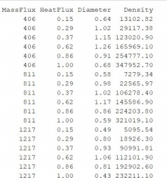
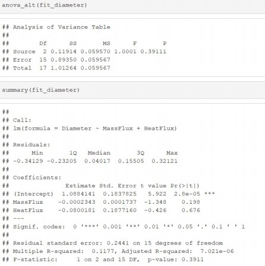
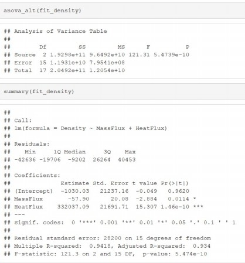

In industry cooling applications (e.g., cooling of nuclear reactors), a process called subcooled flow boiling is often employed. Subcooled flow boiling is susceptible to small bubbles that occur near the heated surface. The characteristics of these bubbles were investigated in Heat Transfer Engineering (Vol. 34, 2013). A series of experiments was conducted to measure two important bubble behaviors-bubble diameter (millimeters) and bubble density (liters per meters squared). The mass flux (kilograms per meters squared per second) and heat flux (megawatts per meters squared) were varied for each experiment. The data obtained at a set pressure are listed in the following table.


```{r}
#| echo: false

df <- data.frame(
    MassFlux = rep(c(406, 811, 1217), each = 6),
    HeatFlux = rep(c(0.15, 0.29, 0.37, 0.62, 0.86, 1.00), times = 3),
    Diameter = c(
        0.64, 1.02, 1.15, 1.26, 0.91, 0.68, # For MassFlux 406
        0.58, 0.98, 1.02, 1.17, 0.86, 0.59, # For MassFlux 811
        0.49, 0.80, 0.93, 1.06, 0.81, 0.43 # For MassFlux 1217
    ),
    Density = c(
        13102.82, 29117.38, 123020.90, 165969.10, 254777.10, 347952.70,
        7279.34, 22565.97, 106278.40, 145586.90, 224203.80, 321019.10,
        5095.54, 18926.30, 90991.81, 112101.90, 192902.60, 232211.10
    )
)
df
```


<!--  -->

```{r}
#| echo: false

source("../../../anova_alt.R")
```


 

# diameter
Consider the multiple regression model of predicting the bubble diameter, 
$$
E(y_1)=\beta_0+\beta_1x_1+\beta_2x_2,
$$
 where $y_1$ = bubble diameter, $x_1$ = mass flux, $x_2$ = heat flux. To conduct a test of overall model utility at $\alpha=0.05$. We conduct a test of overall model utility at $\alpha=0.05$. The output is shown below. 


```{r}
fit_diameter <- lm(Diameter ~ MassFlux + HeatFlux, data = df)
anova_alt(fit_diameter)
summary(fit_diameter)
```


---

<!--  -->

::: {#exr-}
What is the null hypothesis?

- [ ] $H_0: \beta_0=\beta_1=\beta_2=0$.
- [ ] $H_0: \beta_1=\beta_2=0$.
- [ ] $H_0: \beta_0=0$.
- [ ] $H_0: \beta_1=0$.
- [ ] $H_0: \beta_2=0$.

:::


::: {.answer}
- [ ] $H_0: \beta_0=\beta_1=\beta_2=0$.
- [x] $H_0: \beta_1=\beta_2=0$.
- [ ] $H_0: \beta_0=0$.
- [ ] $H_0: \beta_1=0$.
- [ ] $H_0: \beta_2=0$.
:::


::: {#exr-}
What is the alternative hypothesis?

- [ ] $H_a: \beta_0\neq0,\beta_1\neq0, \beta_2\neq0$.
- [ ] $H_a: \beta_1\neq0, \beta_2\neq0$.
- [ ] $H_a: \beta_1\neq0$ or $\beta_2\neq0$.
- [ ] $H_a: \beta_1\neq0$.
- [ ] $H_a: \beta_2\neq0$.
:::


::: {.answer}
- [ ] $H_a: \beta_0\neq0,\beta_1\neq0, \beta_2\neq0$.
- [ ] $H_a: \beta_1\neq0, \beta_2\neq0$.
- [x] $H_a: \beta_1\neq0$ or $\beta_2\neq0$.
- [ ] $H_a: \beta_1\neq0$.
- [ ] $H_a: \beta_2\neq0$.
:::


::: {#exr-}
Find the value of F-statistic (round to 3 decimal places)
:::

::: {.answer}
1.0001
:::

::: {#exr-}
Find the P-value for F-statistic (round to 3 decimal places)
:::


::: {.answer}
0.3911
:::


 

# density
Consider the multiple regression model of predicting the bubble diameter, $E(y_2)=\beta_0+\beta_1x_1+\beta_2x_2$, where $y_2$ = bubble density, $x_1$ = mass flux, $x_2$ = heat flux. We conduct a test of overall model utility at $\alpha=0.05$. The output is shown below. 
<!--  -->

```{r}
fit_density <- lm(Density ~ MassFlux + HeatFlux, data = df)
anova_alt(fit_density)
summary(fit_density)
```

---

::: {#exr-}
What is the alternative hypothesis?

- [ ] $H_a: \beta_0\neq0,\beta_1\neq0, \beta_2\neq0$.
- [ ] $H_a: \beta_1\neq0, \beta_2\neq0$.
- [ ] $H_a: \beta_1\neq0$ or $\beta_2\neq0$.
- [ ] $H_a: \beta_1\neq0$.
- [ ] $H_a: \beta_2\neq0$.
:::


::: {.answer}
- [ ] $H_a: \beta_0\neq0,\beta_1\neq0, \beta_2\neq0$.
- [ ] $H_a: \beta_1\neq0, \beta_2\neq0$.
- [x] $H_a: \beta_1\neq0$ or $\beta_2\neq0$.
- [ ] $H_a: \beta_1\neq0$.
- [ ] $H_a: \beta_2\neq0$.
:::

 

::: {#exr-}
Which is correct? Use critical value method or p-value method to draw a conclusion.

- [ ] Because p-value < $\alpha$, we reject $H_0$. The overall model appears to be statitically useful for predicting bubble density.
- [ ] Because p-value > $\alpha$, we reject $H_0$. The overall model does not appear to be statitically useful for predicting bubble density.
- [ ] Because p-value < $\alpha$, we fail to reject $H_0$. The overall model appears to be statitically useful for predicting bubble density.
- [ ] Because p-value > $\alpha$, we fail to reject $H_0$. The overall model does not appear to be statitically useful for predicting bubble density.

 
:::


::: {.answer}
- [x] Because p-value < $\alpha$, we reject $H_0$. The overall model appears to be statitically useful for predicting bubble density.
- [ ] Because p-value > $\alpha$, we reject $H_0$. The overall model does not appear to be statitically useful for predicting bubble density.
- [ ] Because p-value < $\alpha$, we fail to reject $H_0$. The overall model appears to be statitically useful for predicting bubble density.
- [ ] Because p-value > $\alpha$, we fail to reject $H_0$. The overall model does not appear to be statitically useful for predicting bubble density.

:::

::: {#exr-}
Which of the two dependent variables, diameter ($y_1$) or density ($y_2$), is better predicted by mass flux ($x_1$) and heat flux ($x_2$)?

- [ ] diameter ($y_1$)
- [ ] density ($y_1$)
:::


::: {.answer}
- [ ] diameter ($y_1$)
- [x] density ($y_1$)
:::