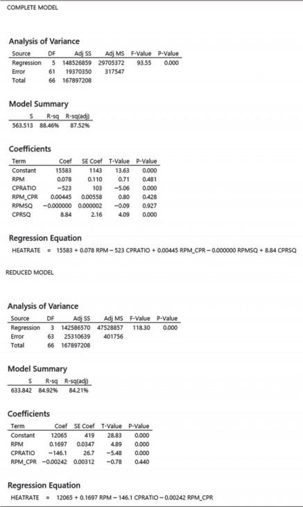

Variables: `HEATRATE`: $y$, `RPM`: $x_1$, `CPRATIO`: $x_2$, `RPM_CPR`: $x_1x_2$, `RPMSQ`: $x_1^2$, `CPRSQ`: $x_2^2$.

From the software output below,

---

```{r}
#| echo: false

dat <- read.csv("data.csv")
fit0 <- lm(HEATRATE ~ RPM + CPRATIO + RPM_CPR + RPMSQ + CPRSQ, data = dat)
fit1 <- lm(HEATRATE ~ RPM + CPRATIO + RPM_CPR, data = dat)
source("../../../anova_alt.R")
```

- Full model
```{r}
#| echo: false
anova_alt(fit0)
```

```{r}
#| echo: false

summary(fit0)
```

 

- Reduced model
```{r}
#| echo: false
anova_alt(fit1)
```

```{r}
#| echo: false

summary(fit1)
```

---

<!--  -->

::: {#exr-}
What is the reduced model?

- [ ] $y=\beta_0+\beta_1x_1+\beta_2x_2+\beta_3x_1x_2+\beta_4x_1^2+\beta_5x_2^2+\epsilon$
- [ ] $y=\beta_0+\beta_1x_1+\beta_2x_2+\epsilon$
- [ ] $y=\beta_0+\beta_1x_1+\beta_2x_2+\beta_3x_1x_2+\epsilon$
- [ ] $y=\beta_0+\beta_1x_1+\beta_2x_2+\beta_3x_1^2+\epsilon$
:::

::: {.answer}
What is the reduced model?

- [ ] $y=\beta_0+\beta_1x_1+\beta_2x_2+\beta_3x_1x_2+\beta_4x_1^2+\beta_5x_2^2+\epsilon$
- [ ] $y=\beta_0+\beta_1x_1+\beta_2x_2+\epsilon$
- [x] $y=\beta_0+\beta_1x_1+\beta_2x_2+\beta_3x_1x_2+\epsilon$
- [ ] $y=\beta_0+\beta_1x_1+\beta_2x_2+\beta_3x_1^2+\epsilon$
:::


::: {#exr-}
What is the full model?

- [ ] $y=\beta_0+\beta_1x_1+\beta_2x_2+\beta_3x_1x_2+\beta_4x_1^2+\beta_5x_2^2+\epsilon$
- [ ] $y=\beta_0+\beta_1x_1+\beta_2x_2+\epsilon$
- [ ] $y=\beta_0+\beta_1x_1+\beta_2x_2+\beta_3x_1x_2+\epsilon$
- [ ] $y=\beta_0+\beta_1x_1+\beta_2x_2+\beta_3x_1^2+\epsilon$
:::

::: {.answer}
What is the full model?

- [x] $y=\beta_0+\beta_1x_1+\beta_2x_2+\beta_3x_1x_2+\beta_4x_1^2+\beta_5x_2^2+\epsilon$
- [ ] $y=\beta_0+\beta_1x_1+\beta_2x_2+\epsilon$
- [ ] $y=\beta_0+\beta_1x_1+\beta_2x_2+\beta_3x_1x_2+\epsilon$
- [ ] $y=\beta_0+\beta_1x_1+\beta_2x_2+\beta_3x_1^2+\epsilon$
:::


::: {#exr-}
What is the $SSE_R$? That is, the SSE of the reduced model.

```{r}
#| echo: false
ssef <- format(floor(anova_alt(fit0)["Error", "SS"]), scientific = FALSE)
sser <- format(ceiling(anova_alt(fit1)["Error", "SS"]), scientific = FALSE)
dfef <- anova_alt(fit0)["Error", "Df"]
dfer <- anova_alt(fit1)["Error", "Df"]
dfrf <- anova_alt(fit0)["Source", "Df"]
dfrr <- anova_alt(fit1)["Source", "Df"]
dft <- anova_alt(fit0)["Total", "Df"]
```
:::

::: {.answer}
`r sser`
:::

::: {#exr-}
What is the $SSE_F$? That is, the SSE of the full model.
:::

::: {.answer}
`r ssef`
:::

::: {#exr-}


```{r}
#| echo: false
anova(fit1, fit0)
```


Which one is the correct formula to cauclate the F-statistics?

- [ ] $\displaystyle F=\frac{\frac{`r ssef`-`r sser`}{`r dfrf-dfrr`}}{\frac{`r sser`}{`r dfef`}}$
- [ ] $\displaystyle F=\frac{\frac{`r sser`-`r ssef`}{`r dfrf-dfrr`}}{\frac{`r ssef`}{`r dfef`}}$
- [ ] $\displaystyle F=\frac{\frac{`r sser`-`r ssef`}{`r dfrr`}}{\frac{`r ssef`}{`r dfrf`}}$
- [ ] $\displaystyle F=\frac{\frac{`r sser`-`r ssef`}{`r dfrf`}}{\frac{`r ssef`}{`r dfef`}}$
:::


::: {.answer}
- [ ] $\displaystyle F=\frac{\frac{`r ssef`-`r sser`}{`r dfrf-dfrr`}}{\frac{`r sser`}{`r dfef`}}$
- [x] $\displaystyle F=\frac{\frac{`r sser`-`r ssef`}{`r dfrf-dfrr`}}{\frac{`r ssef`}{`r dfef`}}$
- [ ] $\displaystyle F=\frac{\frac{`r sser`-`r ssef`}{`r dfrr`}}{\frac{`r ssef`}{`r dfrf`}}$
- [ ] $\displaystyle F=\frac{\frac{`r sser`-`r ssef`}{`r dfrf`}}{\frac{`r ssef`}{`r dfef`}}$

:::

::: {#exr-}
Let $\alpha=0.1$, what is $F_{\alpha}$?

- [ ] 2.40
- [ ] 2.18
- [ ] 3.16
- [ ] 1.95
:::

::: {.answer}

```{r}
qf(0.90, 2, 55)
```

df1 = 5-3

df2 = 61-(5+1) = 55

- [x] 2.40
:::

::: {#exr-}
	
What is the conclusion of the Partial F-test?

- [ ] We prefer the reduced model.
- [ ] We prefer the full model.
:::


::: {.answer}
- [x] We prefer the reduced model.
- [ ] We prefer the full model.

F<Fa, pvalue is too large.
:::